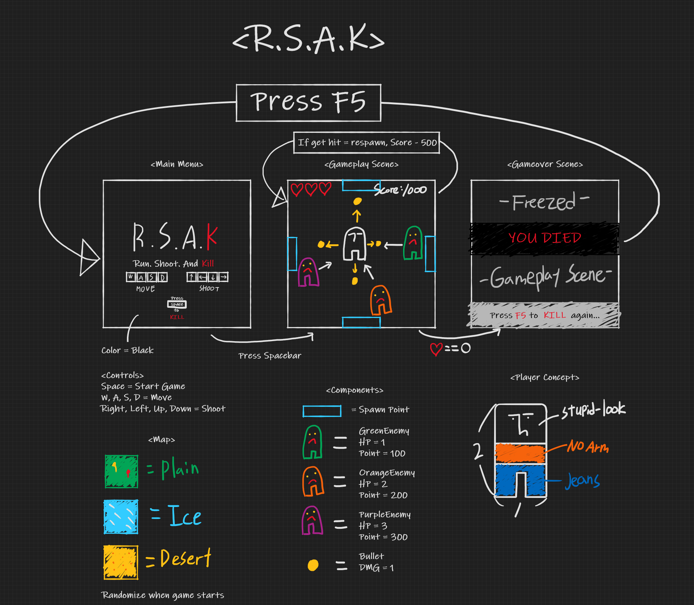

# Name / Assignment / Course/ Term
* Name       : Myunghyun_Kim
* Assignment : CS099-final-project-make-a-game-Assignment
* Course     : CS099
* Spring 2021

# Theme - Take one, Leave the rest
- My game can only shoot one bullet in one direction at a time, and it can kill one enemy. So, I think my game fits the theme of 'Take one, Leave the rest'. Because player have to 'take one'(pick one) enemy and shoot towards that enemy.

# Concept Summary
* Name : R.S.A.K - Run. Shoot. And. Kill.
* Genre : ARPG Defence Shooter, Roguelike
* View : 2D Top View

# Mock Ups
* Please check out the image below.
